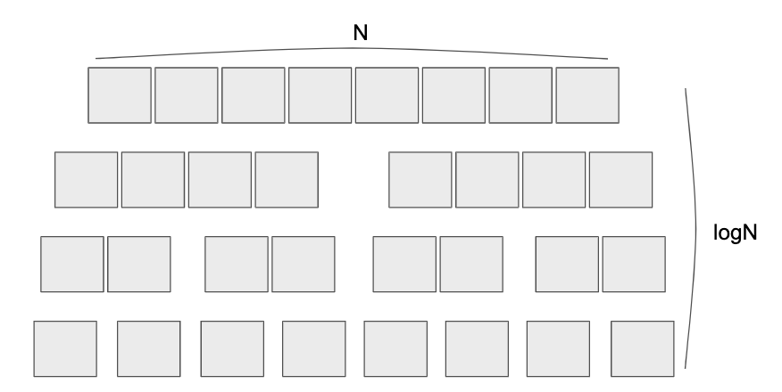

\
안녕하세요. **Mochalatte** 입니다.

이번에 LeetCode에서 [30 Day LeetCoding Challenge](https://leetcode.com/explore/featured/card/30-day-leetcoding-challenge/)를 진행하고 있습니다.\
4월 한 달 동안(`2020.4.1 ~ 30`) 매일 한 문제씩 출제되고, 한국시간 기준으로 매일 오후 4시에 문제가 올라옵니다.\
한 달 동안 챌린지 문제를 풀면서 각 문제에 대한 풀이와 풀면서 필요한 팁을 공유해보고자 합니다.

---

## Day 03. Maximum Subarray [🔗](https://leetcode.com/explore/featured/card/30-day-leetcoding-challenge/528/week-1/3285/)

Given an integer array `nums`, find the contiguous subarray (containing at least one number) which has the largest sum and return its sum.

**Example:**

```bash
Input: [-2, 1, -3, 4, -1, 2, 1, -5, 4]
Output: 6
Explanation: [4, -1, 2, 1] has the largest sum = 6.
```

\
**Follow up:**

If you have figured out the $O(N)$ solution, try coding another solution using the divide and conquer approach, which is more subtle.

---

이 문제는 정수 배열 `nums`가 주어질 때, 가능한 모든 연속 부분 배열(*continuous subarray*) 중에서 합이 가장 큰 것을 구해야 합니다. 예를 들면, `nums`가 $[5, -2, 3]$으로 주어졌다고 생각해 보겠습니다. 그러면 가능한 모든 연속 부분 배열은 $[5]$, $[-2]$, $[3]$, $[5, -2]$, $[-2, 3]$, $[5, -2, 3]$입니다. 이때, 각 연속 부분 배열의 합을 구해보면 $5$, $-2$, $3$, $3$, $1$, $6$이고, 그 중 가장 큰 연속 부분 배열은 합이 $6$인 $[5, -2, 3]$이 되는 것입니다.

이러한 문제는 어떻게 풀어야 할까요? 단순한 방법부터 시작해보겠습니다.

---

### 첫 번째 접근 : 모든 연속 부분 배열 구해보기

이 문제를 푸는 방법으로 가장 쉽게 떠올릴 수 있는 것은 가능한 모든 경우를 구해보는 것입니다. 즉, $[a_1, a_2, a_3, ..., a_n]$이 주어졌을 때, $[a_1]$, $[a_2]$, $...$, $[a_2, ..., a_n]$, $[a_1, a_2, ..., a_n]$과 같이 모든 경우의 수를 구하고, 각각의 합을 구해보는 것입니다. 이렇게 구하면 모든 경우를 비교하기 때문에 확실한 답을 찾을 수 있습니다.

첫 번째 접근에 대한 코드는 다음과 같습니다.

```cpp
class Solution {
public:
    const int INF = 0x7fffffff;
    int maxSubArray(vector<int>& nums) {
        int n = nums.size();
        int answer = -INF;
        for (int i = 0; i < n; ++i) {
            int sum = 0;
            for (int j = i; j < n; ++j) {
                sum += nums[j];
                answer = max(answer, sum);
            }
        }
        return answer;
    }
};
```

이 코드의 시간 복잡도는 어떻게 될까요? 시간 복잡도를 결정하는 요소는 반복문인데 이 로직에서는 2중 for문을 돌고 있으므로 $O(N^2)$입니다. 문제의 제한 조건이 작다면 충분히 사용할만 하지만 $N$이 $10000$을 넘어가면 $10000^2 = 10^8$이므로 `시간초과`에 걸리기 쉽습니다.

---

### 두 번째 접근 : 이전 값 활용하기 (Dynamic Programming; DP)

이 문제의 소재인 "**연속**" 부분 배열에서 연속이란 조건에 집중해 보겠습니다. 연속이란 조건이 있기 때문에 `nums` 배열에서 $i$번째 원소를 포함한 부분 배열을 구하고자 하면 연속적으로 인접한 원소들만 신경쓰면 됩니다. 따라서 이전에 봤던 값들만 활용하면 원소들을 두 번 볼 필요없이 효율적으로 가장 큰 연속 부분 배열의 합을 구할 수 있습니다.

여기서 이전에 봤던 값들을 활용한다는 것은 `nums` 배열을 순서대로 보면서 합을 구하고, 만약 그 합이 음수가 된다면 그 수에서 다른 수를 더하는 것보다 아무것도 사용하지 않은 0에서 더하는 것이 더 크다는 점을 생각하여 여태까지 더한 합을 0으로 초기화 시키는 것입니다. 이렇게하면 연속적으로 더한 합이 항상 0보다 크거나 같아지므로 $i$번째 값을 더했을 때, 합이 $i$번째 값보다 작아지지 않는 것을 기대할 수 있습니다. 즉, $i$번째 원소를 마지막으로 포함하는 연속 부분 배열의 합 중에서 가장 큰 값을 구하게 됩니다. 그리고 이러한 값 중에서 가장 큰 값을 정답으로 취하면 됩니다.

두 번째 접근에 대한 코드는 다음과 같습니다.

```cpp
class Solution {
public:
    const int INF = 0x7fffffff;
    int maxSubArray(vector<int>& nums) {
        int answer = -INF;
        int sum = 0;
        for (int i = 0; i < nums.size(); ++i) {
            sum += nums[i];
            answer = max(answer, sum);
            sum = max(sum, 0);
        }
        return answer;
    }
};
```

이 코드의 시간 복잡도는 `nums` 배열을 한 번만 순회하므로 $O(N)$이 됩니다. 또한, 공간 복잡도는 추가 메모리를 거의 사용하지 않으므로 $O(1)$입니다. 따라서 첫 번째 접근보다 더 큰 범위의 $N$의 값을 커버할 수 있게 됩니다.

> 이러한 알고리즘은 `카데인 알고리즘 (Kadane's Algorithm)`으로 알려져 있습니다.

---

### 세 번째 접근 : 분할정복 (Divide & Conquer)

문제의 **Follow up** 부분을 보면, 시간 복잡도 $O(N)$인 솔루션을 알아 내었다면 분할정복으로 해결하는 것을 시도해보라고 합니다. 그래서 두 번째 접근보다 비효율적이긴 하지만 `분할정복`으로 해결하는 방법을 생각해보려고 합니다.

우선 분할정복을 사용한다는 것은 주어진 구간을 계속 분할하여 **작은 단위**로 만들고, 작은 단위부터 계산하여 정복하고 다시 합쳐 더 **큰 구간을 정복**해 나가는 것입니다. 이 문제의 경우 주어진 구간을 절반으로 나누고, 나누어진 두 구간과 걸쳐진 구간에 대하여 각각 최대합을 구하고, 그 중 최댓값을 전체 구간의 최대합으로 사용합니다.

조금 더 자세하게 설명해보겠습니다. 우선 분할정복을 하는 함수는 해당 구간을 분할정복해서 그 구간에 대한 최대합을 리턴하도록 설계합니다. 그런 함수를 이용하여 전체 구간에 대하여 실시하면 재귀적으로 전체 구간을 절반씩 쪼개나가다가 **구간의 길이가 1이 될 때**(**`기저 조건`**) 더 이상 쪼갤 수 없게 되고, 이때 최대합은 곧 해당 원소의 값이므로 그대로 리턴하게 됩니다. 그리고 특정 구간 하나를 생각해보면 해당 구간을 절반으로 쪼개서 두 구간에 대한 최대합을 구했는데, 각 구간에 있는 값을 모두 이용해야 더 큰 최대합이 되는 경우가 있을 수 있으므로 쪼개진 부분을 기준으로 **왼쪽으로 최소 한 개, 오른쪽으로 최소 한 개**를 선택하여 최대합을 구합니다. 그렇게 특정 구간에 대하여 **왼쪽, 오른쪽, 걸친 구간**의 최대합을 모두 비교하여 그 중 최댓값을 해당 특정 구간에 대한 최대합으로 취합니다. 그렇게 재귀적으로 정복해 나가다보면 전체 구간에 대한 최대합도 구할 수 있게 됩니다.

세 번째 접근에 대한 코드는 다음과 같습니다.

```cpp
class Solution {
public:
    const int INF = 0x7fffffff;
    int divide_and_conquer(vector<int>& nums, int lo, int hi) {
        if (lo == hi) return nums[lo];
        int mid = lo + (hi - lo) / 2;
        int left = divide_and_conquer(nums, lo, mid);
        int right = divide_and_conquer(nums, mid + 1, hi);

        int sum_left = -INF, sum_right = -INF;
        for (int i = mid, tmp = 0; i >= lo; --i) {
            tmp += nums[i];
            sum_left = max(sum_left, tmp);
        }
        for (int i = mid + 1, tmp = 0; i <= hi; ++i) {
            tmp += nums[i];
            sum_right = max(sum_right, tmp);
        }
        int both = sum_left + sum_right;
        return max({left, right, both});
    }
    int maxSubArray(vector<int>& nums) {
        return divide_and_conquer(nums, 0, (int)nums.size() - 1);
    }
};
```

이 코드의 시간 복잡도는 어떻게 될까요? 정답은 바로 $O(NlogN)$입니다. 그 이유는 아래 그림과 같이 `nums` 배열을 절반씩 나누어 내려가면서 각각의 구간을 전부 훑게 되는데, 쪼개서 내려가는 깊이가 $logN$이고, 전체 원소의 갯수가 $N$이기 때문에 총 $NlogN$이 되는 것입니다.



---

지금까지 **30 Day LeetCoding Challenge**의 세 번째 문제인 **Maximum Subarray**에 대한 내용이었습니다.

혹시라도 부족한 부분이 보이시면 언제든지 **피드백**을 해주세요!

감사합니다. 🙇🏻‍
